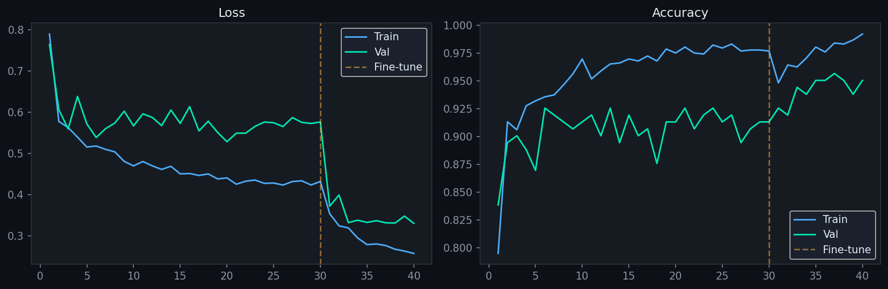
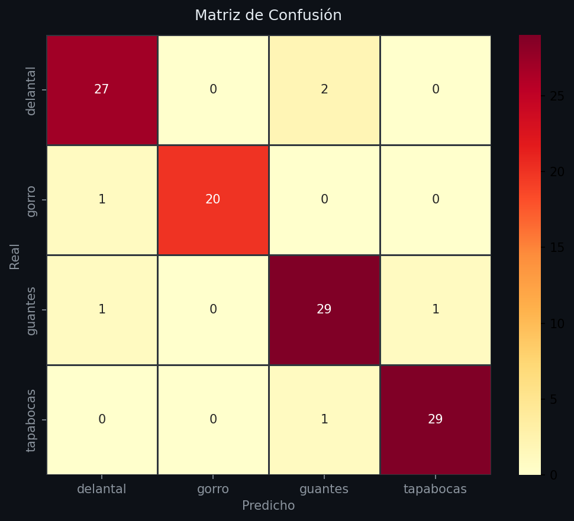

# Sistema de Monitoreo de EPP en Cafetería UAO

Proyecto final de Procesamiento Digital de Imágenes orientado al monitoreo de higiene y bioseguridad en un entorno de cafetería universitaria.

El sistema permite analizar imágenes de personas en una cafetería y determinar si cumplen con el uso de elementos de protección personal: delantal, gorro, guantes y tapabocas.

## Contexto del proyecto

En una cafetería universitaria, el cumplimiento de medidas de higiene y bioseguridad es importante para reducir riesgos durante la manipulación de alimentos. Sin embargo, realizar una supervisión constante puede ser difícil debido al movimiento continuo del personal, los cambios de iluminación, la superposición de objetos y la presencia de varias actividades al mismo tiempo.

Por esta razón, el proyecto propone un sistema basado en visión computacional que apoye la verificación del uso de elementos de protección personal en espacios de alimentación del campus.

## Objetivo del sistema

Desarrollar un prototipo funcional basado en procesamiento digital de imágenes y visión computacional que permita analizar imágenes de una cafetería universitaria, detectar personas y evaluar el cumplimiento del uso de elementos de protección personal.

## ¿Qué hace el sistema?

El sistema analiza una imagen de entrada y genera una evaluación visual del cumplimiento de EPP.

El flujo general es:

1. Recibe una imagen desde la interfaz web.
2. Detecta personas en la imagen usando YOLOv11n.
3. Recorta cada persona detectada.
4. Clasifica los elementos de protección personal mediante una CNN basada en MobileNetV2.
5. Calcula el porcentaje de cumplimiento por persona.
6. Genera una imagen anotada con bounding boxes y resultados.
7. Registra las inspecciones del turno.
8. Permite descargar un reporte resumen.

## Elementos de protección evaluados

El sistema evalúa cuatro clases principales:

- Delantal
- Gorro
- Guantes
- Tapabocas

## Arquitectura general del sistema

El sistema está dividido en dos partes principales:

- **Backend:** recibe las imágenes, ejecuta el modelo de visión computacional y devuelve los resultados.
- **Frontend:** permite al usuario interactuar con el sistema, cargar imágenes, ejecutar simulaciones, visualizar resultados y descargar el reporte del turno.

El pipeline de análisis combina:

- **YOLOv11n:** usado para detectar personas dentro de la imagen.
- **CNN MobileNetV2:** usada para clasificar la presencia de elementos de protección personal en cada persona detectada.
- **FastAPI:** usado para exponer los endpoints del backend.
- **Next.js / React:** usado para construir la interfaz web.

## Estructura del repositorio

```text
MonitoreoEPP-Cafeteria/
├── PruebasPDI/
├── backend/
│   ├── model/
│   │   ├── confusion_matrix.png
│   │   ├── epp_classifier.pt
│   │   ├── model_meta.json
│   │   └── training_history.png
│   │
│   ├── main.py
│   ├── requirements.txt
│   ├── runtime.txt
│   ├── train.py
│   └── yolo11n.pt
│
├── dataset_clasificacion/
│   ├── test/
│   ├── train/
│   └── valid/
│
├── frontend/
│   ├── app/
│   │   ├── globals.css
│   │   ├── layout.tsx
│   │   └── page.tsx
│   │
│   ├── components/
│   │   └── TrendChart.tsx
│   │
│   ├── lib/
│   │   ├── accumulator.ts
│   │   └── types.ts
│   │
│   ├── public/
│   │   ├── test/
│   │   ├── alarma.mp3
│   │   └── uao.png
│   │
│   ├── next-env.d.ts
│   ├── next.config.js
│   ├── package-lock.json
│   ├── package.json
│   ├── postcss.config.js
│   ├── tailwind.config.js
│   └── tsconfig.json
│
├── .gitignore
├── README.md
├── alarma.mp3
├── runtime.txt
└── uao.png
```

## Descripción de carpetas y archivos principales

### `backend/`

Contiene la lógica del servidor y el procesamiento principal del sistema.

- `main.py`: contiene la API desarrollada con FastAPI. Recibe imágenes, detecta personas, clasifica los EPP y devuelve los resultados al frontend.
- `train.py`: contiene el proceso de entrenamiento del modelo CNN basado en MobileNetV2.
- `requirements.txt`: lista las dependencias necesarias para ejecutar el backend.
- `runtime.txt`: indica la versión de Python usada para el entorno de ejecución.
- `yolo11n.pt`: archivo del modelo YOLO utilizado para la detección de personas.

### `backend/model/`

Contiene los archivos generados durante el entrenamiento del modelo de clasificación.

- `epp_classifier.pt`: pesos del modelo CNN entrenado.
- `model_meta.json`: información general del modelo, como clases, tamaño de imagen, arquitectura y accuracy.
- `training_history.png`: gráfica del comportamiento de pérdida y accuracy durante entrenamiento y validación.
- `confusion_matrix.png`: matriz de confusión obtenida durante la evaluación del modelo.

### `dataset_clasificacion/`

Contiene el dataset utilizado para entrenar, validar y probar el modelo. Está dividido en:

- `train`: imágenes usadas para entrenamiento.
- `valid`: imágenes usadas para validación.
- `test`: imágenes usadas para evaluación final.

Cada subconjunto contiene las clases:

```text
delantal/
gorro/
guantes/
tapabocas/
```

### `frontend/`

Contiene la interfaz web del sistema.

- `app/page.tsx`: pantalla principal de la aplicación. Permite subir imágenes, ejecutar la simulación, visualizar resultados, ver el registro del turno y descargar el reporte.
- `app/layout.tsx`: estructura base de la aplicación.
- `app/globals.css`: estilos globales de la interfaz.
- `components/TrendChart.tsx`: componente usado para visualizar la tendencia del cumplimiento durante el turno.
- `lib/accumulator.ts`: contiene la lógica para acumular inspecciones, calcular estadísticas y reiniciar el turno.
- `lib/types.ts`: define tipos de datos usados por la aplicación.
- `public/test/`: contiene imágenes usadas por el frontend para la simulación automática.
- `public/alarma.mp3`: recurso de audio usado en la aplicación.
- `public/uao.png`: imagen institucional usada en la interfaz.
- `package.json`: dependencias y scripts del frontend.
- `package-lock.json`: archivo generado por npm para registrar versiones exactas de dependencias.
- `tailwind.config.js`, `postcss.config.js`, `tsconfig.json` y `next.config.js`: archivos de configuración del frontend.

### `PruebasPDI/`

Contiene 41 imágenes de prueba utilizadas durante el desarrollo y validación visual del sistema. Estas imágenes permiten evidenciar diferentes escenarios de análisis y resultados obtenidos durante las pruebas del proyecto.

### Archivos generales

- `.gitignore`: define archivos y carpetas que no deben subirse al repositorio.
- `README.md`: guía principal del proyecto.
- `alarma.mp3`: recurso de audio general del proyecto.
- `uao.png`: imagen institucional usada como recurso visual.
- `runtime.txt`: archivo de referencia para indicar versión de ejecución.

## Dataset

El dataset utilizado está incluido en el repositorio dentro de la carpeta:

```text
dataset_clasificacion/
```

Está organizado en tres subconjuntos:

- `train`: imágenes usadas para entrenar el modelo.
- `valid`: imágenes usadas para validar el desempeño durante el entrenamiento.
- `test`: imágenes usadas para la evaluación final.

Cada subconjunto contiene carpetas para las cuatro clases evaluadas:

```text
delantal/
gorro/
guantes/
tapabocas/
```

Esta organización permite entrenar, validar y probar el modelo de forma separada.

## Modelo de clasificación

Para clasificar los elementos de protección personal se entrenó una red CNN basada en MobileNetV2.

El modelo recibe como entrada el recorte de una persona detectada y estima la presencia de:

- Delantal
- Gorro
- Guantes
- Tapabocas

A partir de estas predicciones, el sistema calcula qué elementos están presentes, cuáles faltan y cuál es el porcentaje de cumplimiento.

## Resultados del modelo

El modelo entrenado obtuvo una precisión final en el conjunto de prueba de:

```text
Test Accuracy: 94.59%
```

Este valor se encuentra registrado en:

```text
backend/model/model_meta.json
```

Las siguientes gráficas se incluyen como evidencia rápida del entrenamiento y la evaluación del modelo. La interpretación completa de estos resultados se desarrolla en el informe del proyecto.

### Historial de entrenamiento



### Matriz de confusión



## Requisitos

### Backend

- Python 3.11
- FastAPI
- Uvicorn
- PyTorch
- Torchvision
- Ultralytics
- Pillow
- NumPy
- OpenCV
- Scikit-learn
- Matplotlib
- Seaborn

### Frontend

- Node.js
- Next.js
- React
- TypeScript
- Tailwind CSS

## Instalación y ejecución

Para ejecutar el sistema se deben usar dos terminales: una para el backend y otra para el frontend.

## 1. Clonar el repositorio

```bash
git clone URL_DEL_REPOSITORIO
cd MonitoreoEPP-Cafeteria
```

## 2. Ejecutar el backend

Entrar a la carpeta del backend:

```bash
cd backend
```

Crear el entorno virtual:

```bash
python -m venv venv
```

Activar el entorno virtual en Windows:

```bash
venv\Scripts\activate
```

En caso de usar PowerShell, también puede ejecutarse:

```bash
.\venv\Scripts\Activate.ps1
```

Instalar las dependencias:

```bash
pip install -r requirements.txt
```

Ejecutar el servidor:

```bash
python -m uvicorn main:app --reload --port 8000
```

El backend queda disponible en:

```text
http://localhost:8000
```

## 3. Ejecutar el frontend

Abrir una nueva terminal y entrar a la carpeta del frontend:

```bash
cd frontend
```

Instalar las dependencias:

```bash
npm install
```

Ejecutar la aplicación:

```bash
npm run dev
```

La aplicación queda disponible en:

```text
http://localhost:3000
```

Si Next.js asigna otro puerto, revisar la URL mostrada en la terminal.

## Entrenamiento del modelo

El repositorio ya incluye el modelo entrenado en la carpeta:

```text
backend/model/epp_classifier.pt
```

Si se desea volver a entrenar el modelo, ejecutar el siguiente comando desde la carpeta `backend`:

```bash
python train.py --dataset ../dataset_clasificacion --epochs 30 --ft_epochs 10 --batch 32
```

Al finalizar el entrenamiento se generan los siguientes archivos dentro de `backend/model/`:

```text
epp_classifier.pt
model_meta.json
training_history.png
confusion_matrix.png
```

Estos archivos corresponden al modelo entrenado, la metadata del entrenamiento y las gráficas de evaluación.

## Uso del sistema

El sistema cuenta con dos modos principales de uso: modo manual y modo simulación.

## Modo manual

En este modo el usuario carga una imagen desde la interfaz.

Pasos:

1. Abrir la aplicación web.
2. Seleccionar la opción para subir una imagen.
3. Cargar una imagen de prueba.
4. Esperar el análisis del sistema.
5. Revisar los resultados mostrados en pantalla.

El sistema muestra:

- Imagen analizada.
- Personas detectadas.
- Elementos de protección presentes.
- Elementos de protección faltantes.
- Porcentaje de cumplimiento.
- Alertas generadas.

## Modo simulación

El modo simulación permite ejecutar inspecciones automáticas para representar un monitoreo periódico.

El sistema cuenta con dos opciones:

- **Demo 12s:** realiza una inspección automática cada 12 segundos para visualizar rápidamente el comportamiento del sistema en un periodo corto.
- **Real 5min:** realiza una inspección cada 5 minutos, simulando un monitoreo periódico durante el turno.

## Registro de inspecciones

Durante la simulación, el sistema guarda un registro de las inspecciones realizadas en el turno.

Este registro permite consultar:

- Número de inspecciones realizadas.
- Hora de cada inspección.
- Cantidad de personas detectadas.
- Cumplimiento general por inspección.
- Cumplimiento general del turno.
- Elementos de protección con mayor incumplimiento.
- Alertas activas.
- Tendencia del turno.

## Reporte del turno

El sistema permite descargar un reporte del turno en formato `.txt` con el resumen de las inspecciones realizadas.

El reporte incluye:

- Fecha del turno.
- Cumplimiento global.
- Total de inspecciones.
- Inspecciones con incumplimientos.
- Hora crítica.
- EPP más crítico.
- Porcentaje de cumplimiento por cada EPP.
- Detalle de cada inspección realizada.

## Reinicio del turno

El sistema incluye la opción **Resetear turno**, que permite borrar los registros acumulados de la sesión actual e iniciar un nuevo análisis desde cero.

Esta opción es útil cuando se quiere comenzar una nueva simulación, realizar otra prueba o separar los datos de un turno anterior.

## Endpoints principales del backend

El backend expone los siguientes endpoints:

```text
GET /
```

Devuelve información general del sistema.

```text
GET /health
```

Permite verificar si el backend está activo y si el modelo está disponible.

```text
POST /detect
```

Recibe una imagen y devuelve el resultado del análisis.

```text
POST /detect/base64
```

Recibe una imagen en formato base64 y devuelve el resultado del análisis.

## Video demostrativo

Enlace al video demostrativo:

```text
Enlace del video
```

## Integrantes

- David Mena
- Hellen Cuenú
- Josué Gallego

## Observaciones

Este sistema corresponde a un prototipo académico desarrollado para la asignatura Procesamiento Digital de Imágenes.

Su propósito es demostrar el uso de procesamiento digital de imágenes, visión computacional e inteligencia artificial para apoyar una necesidad dentro de un campus universitario.

El sistema no reemplaza una inspección formal de bioseguridad, pero puede servir como apoyo para identificar incumplimientos, generar registros de inspección y aportar información útil para la toma de decisiones.
